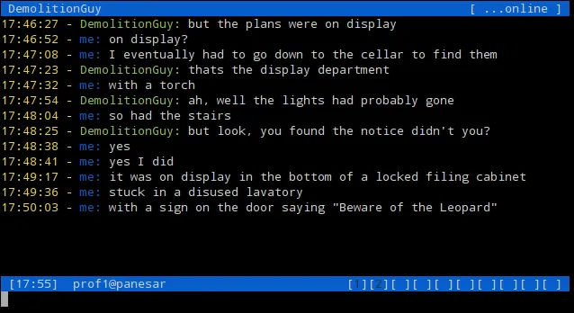
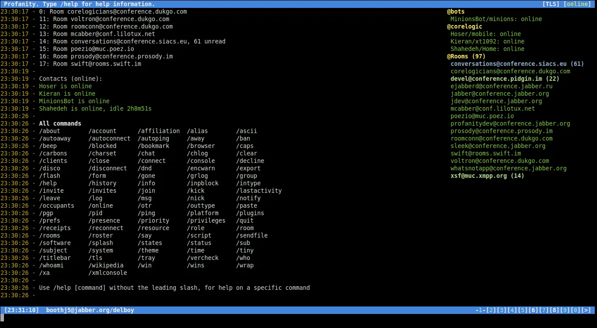
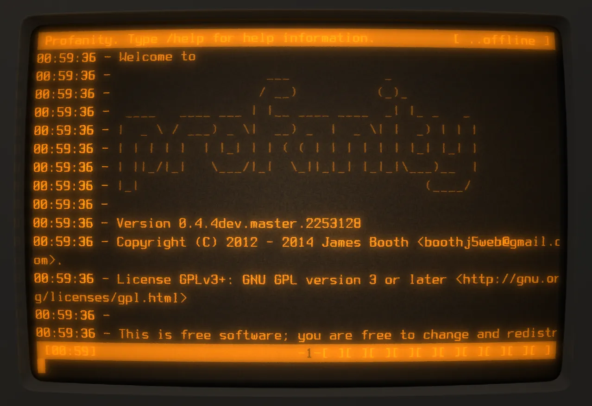
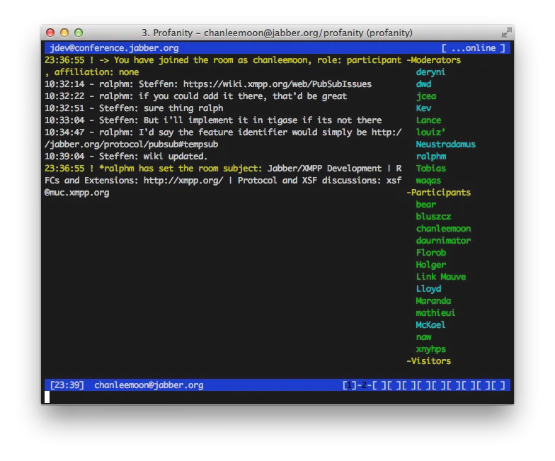
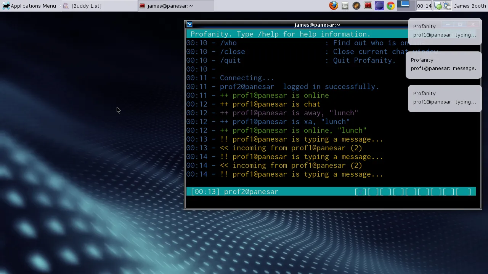
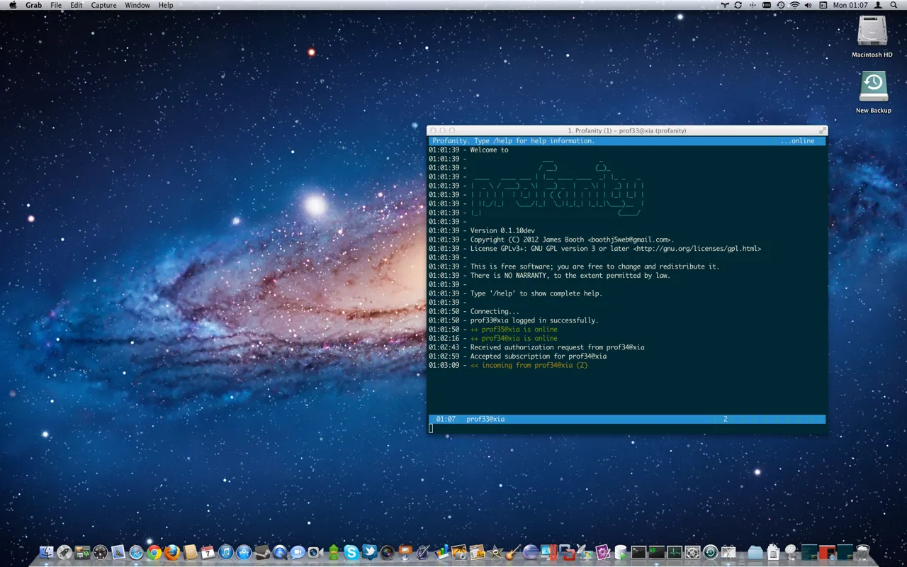
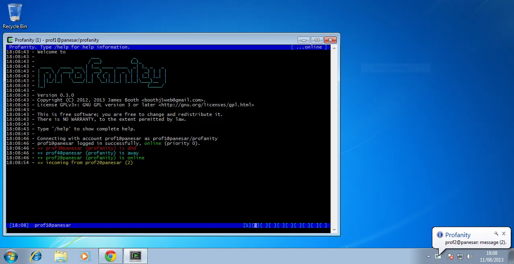
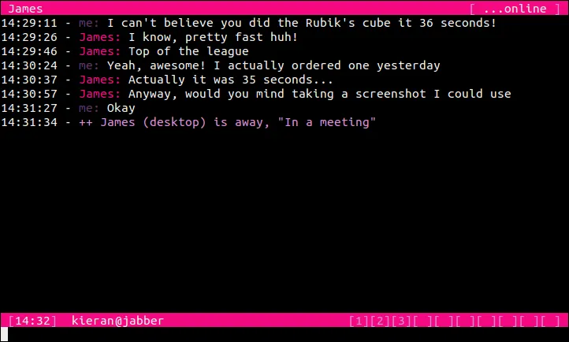
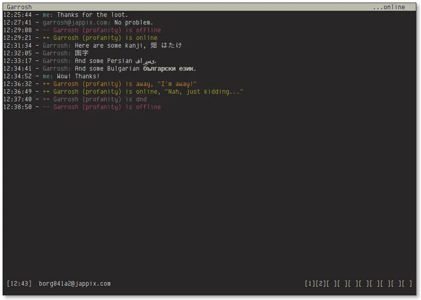

title: Profanity, a console based XMPP client - Home
subtitle: A console based XMPP client

${div_content}

#### Profanity is a console based XMPP client written in C using [ncurses](http://www.gnu.org/software/ncurses/) and [libstrophe](http://strophe.im/libstrophe/), inspired&nbsp;by&nbsp; [Irssi](http://irssi.org/)

Available on Linux, FreeBSD, OpenBSD, OSX, Windows and Android (Termux)  

Do you like Profanity?  
Consider [donating](donate.html)!  

**Latest release:**
**[profanity-${version}.tar.xz](tarballs/profanity-${version}.tar.xz id="download-tarball")**  
sha256:  ${tar_xz_sha256}  
  
**[profanity-${version}.zip](tarballs/profanity-${version}.zip id="download-zip")**  
sha256:  ${zip_sha256}  

**Documentation:**  
[User Guide](userguide.html)  
[FAQ](faq.html)  
[Supported XEPs](xeps.html)  
[Plugins](plugins.html)  
[Reporting Issues](issues.html)  
[How to help out](helpout.html)  
[Blog](blog/post/index.html)  
[Theme Gallery](themegallery.html)  

**Links:**  
[GitHub](http://github.com/profanity-im/profanity)  
[Mailing List](https://lists.posteo.de/listinfo/profanity)  
[X](https://x.com/profanityim)  
[xmpp:profanity@rooms.dismail.de](xmpp:profanity@rooms.dismail.de?join)  

${div_end}

${div_features}

### Features

- Supports XMPP chat services
- MUC chat room support
- OTR, PGP and OMEMO encryption
- Roster management
- Flexible resource and priority settings
- Desktop notifications
- Plugins in Python and C

${div_end}

${div_screenshots}

### Screenshots

- 
- 
- 
- 
- 
- 
- 
- 
- 

${div_end}
